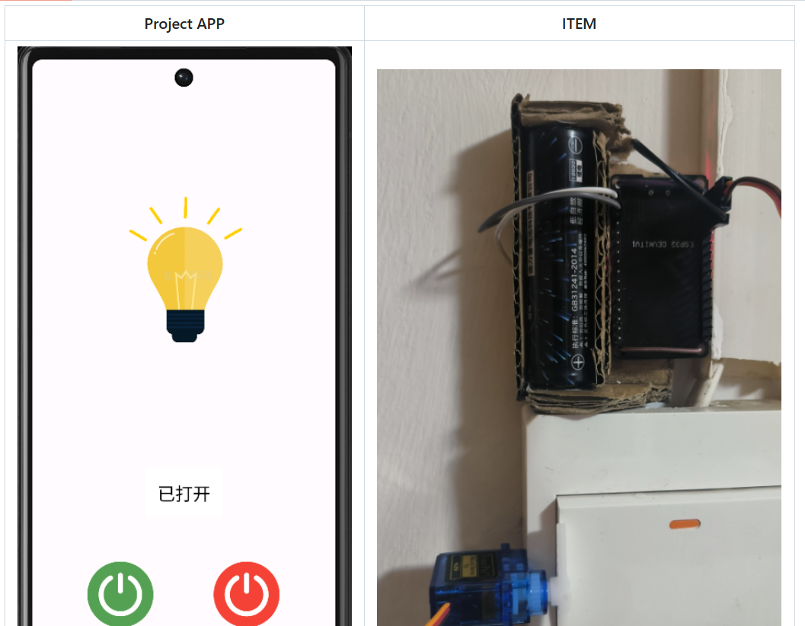
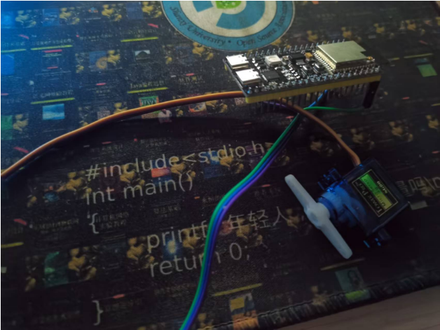

# 数字人小源

使用的是awesome-digital-human-live2d 的前端 + Fay中间框架 + GPT-SoVITS TTS,理论上可以多端同时访问，但是时间紧没做出来，感兴趣的同学只能线下来和小源交流了，唤醒词是“小源”

# 三模关灯神器（支持米家）

人们至今仍会想起那个冬天，宿舍最后上床的人没有关灯

[Electrical-switches](https://github.com/lglglglgy/Electrical-switches)

造价大概不到20吧，某位不愿意透露姓名的神秘社员做的，十分优雅

# 有个学长可能要拿3D打印机来

# 没了

今年就这样吧，经典早就揽下的事拖到deadline才干然后不睡觉，敲完这行字人都快飞升了
